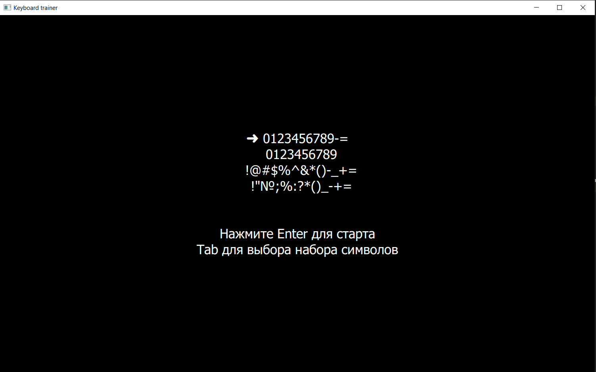
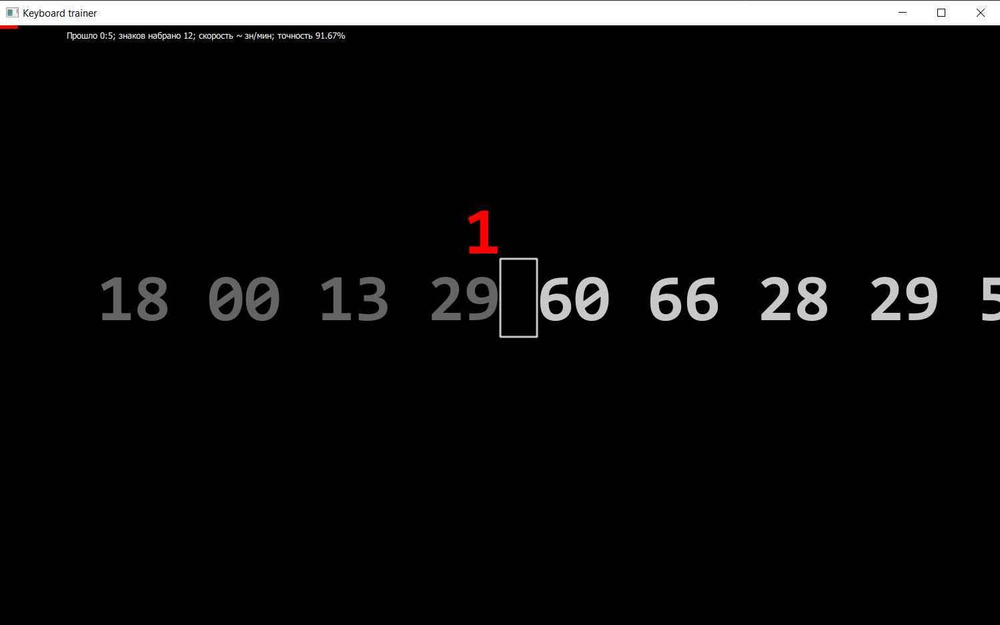

# [PyQT] [Russian] Клавиатурный тренажёр цифровой клавиатуры

Тренажёр создан специально для прокачки слепого набора на цифровой клавиатуре, находящейся выше клавиш с буквами.
Приложение ведёт запись ваших успехов в специальный файл в папку приложения. До конца сеанса запись можно сделать принудительно через клавишу F3.
Клавиши с 1 по 6 включительно нажимаются пальцами левой руки, остальные - пальцами правой руки.

## Скриншоты

## Системные требования

Приложение нормально работало для версии Python 3.10.8 на Windows 10, в других версиях и операционках не тетировалось.

## Зависимости

`pip install PyQt5==5.15.7`
